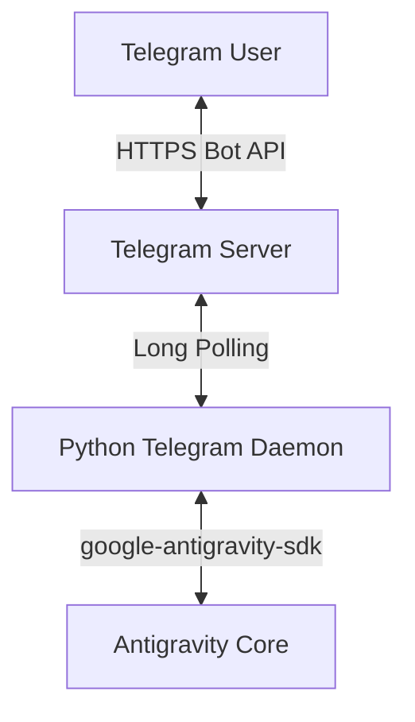

# Telegram Bridge for Antigravity & AeroDeck Design Specification

This specification outlines the design for a Python-based Telegram daemon that enables remote execution and management of Antigravity and AeroDeck workflows.

## Goal
To allow users to securely trigger, monitor, and interact with Antigravity agent sessions (specifically utilising AeroDeck skills) remotely via Telegram, including command approvals, file transfers, and real-time task management.

## Technical Architecture
The system consists of a Python daemon running on the host machine that communicates with Telegram via the Telegram Bot API and with Antigravity via the `google-antigravity-sdk`.

### Components

1. **Telegram Listener (Python):**
   * Uses `python-telegram-bot` to manage connections and handle commands/messages.
   * Runs in a long-polling loop or handles incoming webhooks.

2. **Security Whitelist Filter:**
   * A verification layer that compares incoming message `user_id`s against a hardcoded or env-configured list of allowed Telegram user IDs.
   * Unauthorised interactions are discarded with no response.

3. **Session Mapper:**
   * Maps a Telegram `chat_id` to an active Antigravity session/workspace thread.
   * Handles starting, resuming, and resetting workspaces.

4. **Interactive Action Handler:**
   * Intercepts Antigravity's request-for-approval events (e.g. `run_command` prompts).
   * Formats the request into a Telegram message with Inline Keyboard Buttons (`[ Approve ]` / `[ Reject ]`).
   * Feeds the user's choice back to the SDK to resume or abort execution.

5. **Artifact Delivery & File Watcher:**
   * Monitors the active workspace for new or changed files.
   * Sends generated markdown documents, text artifacts (`task.md`, design specs), and images (`generate_image` outputs) directly to the Telegram chat.

6. **Workspace Ingestion:**
   * Accepts files uploaded to the Telegram bot (scripts, configs, datasets) and saves them directly into the current Antigravity workspace directory on the host.

## Detailed Command Specification

* `/start`: Verifies authorisation and greets the user.
* `/aerodeck`: Automates the bootstrap command (`/using-aerodeck`) in the underlying Antigravity session.
* `/reset`: Closes the current Antigravity session and starts a new one with a clean state.
* `/status`: Displays the status of currently running background tasks, subagents, and resource utilisation.

## Error Handling & Resilience
* **Network Interruption:** If connection to Telegram is lost, the daemon continues running locally. Active tasks on the host will complete. Upon reconnect, the bot retrieves any missed update messages and notifies the user of task completion.
* **Command Output Throttling:** For terminal output streaming, the daemon will update a single, collapsible code-blocked message rather than flooding the chat with multiple messages.

## Verification & Testing Plan
* **Authentication Lockout:** Test messaging the bot from an unauthorised Telegram account. Verify the bot ignores the message and logs a warning on the host.
* **Interactive Approval Flow:** Run a test command (e.g. a simple echo) that triggers an approval check, prompt the user on Telegram, click `Approve`, and verify execution finishes successfully.
* **Media Handling:** Trigger an image generation task and verify it is received as a high-quality photo in the chat.
