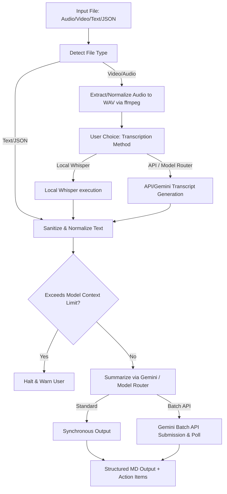

# Design Specification: Transcript Processing Skill

This document details the architecture, configuration options, and output formats for the `transcript-processing` skill in AeroDeck. This skill processes meeting transcripts, call logs, audio, and video files to clean, transcribe, summarize, and extract custom sections and action items with context safety checks and Gemini Batch API support.

---

## 1. Goal & Requirements
*   **Multimodal Input Support:** Accept input files in text, JSON, audio, or video formats.
*   **Media Processing:** Programmatically extract audio from video files using `ffmpeg` when audio/video inputs are provided.
*   **Flexible Transcription:** Allow the user to choose between local transcription (Whisper) or API-based transcription (Google GenAI / Gemini / Model Router).
*   **Context Safety Checks:** Check estimated token/character size of the transcript against target model limits before execution to prevent context overflows.
*   **Gemini Batch API Support:** Support Gemini Batch API for offline/asynchronous processing of long summaries.
*   **Configurable Summary Sections:** Dynamically generate custom summary headers based on user-supplied options (e.g., Attendees, Technical Decisions, Unresolved Questions).
*   **Action Items Table:** Standardized output format with Task ID, Description, Assignee, Deadline, and Priority.

---

## 2. Architecture & Data Flow

### Flow Step Details:
1.  **File Validation & Detection:** Identify if the file extension is text (`.txt`, `.json`, `.md`) or media (`.mp4`, `.mkv`, `.mp3`, `.wav`, etc.).
2.  **Audio Extraction:** Run `ffmpeg -y -i <input_file> -vn -acodec pcm_s16le -ar 16000 -ac 1 <output_wav>` to extract a mono, 16kHz WAV file.
3.  **Transcription Logic:**
    *   *whisper*: Executes local python whisper library (if installed) or CLI command.
    *   *api*: Uploads the media to Gemini File API or routes to the model-router transcription endpoint.
4.  **Verification:** Parse or count characters/tokens. If greater than 90% of the target model's limits, alert/halt.
5.  **Summarization:** Construct a structured prompt including custom sections and action item schema, then invoke Gemini (sync or batch) or the model router.

---

## 3. Configuration Options
*   `--input-file`: File path to transcribe/summarize.
*   `--transcribe-method`: `whisper` (local) or `api` (Google GenAI / Model Router).
*   `--summary-model`: Target model name (e.g., `gemini-1.5-flash`, `moonshot-v1-128k`).
*   `--custom-sections`: JSON array of custom headers to extract (e.g. `["Attendees", "Decisions"]`).
*   `--batch-mode`: `true` or `false` (enables Gemini Batch Processing API).

---

## 4. Standard Verification Plan

### Automated Checks
*   **RED Check (Failure Mode):** A simulated subagent receives a meeting transcript and summarizes it without executing the context check or supporting custom sections, leading to formatting discrepancies and potential overflow risk.
*   **GREEN Check (Success Mode):** A Python script successfully runs on a test transcript/audio file, validates context size, performs the correct transcription routing, and produces a BLUF, the requested custom sections, and an Action Items Table.
