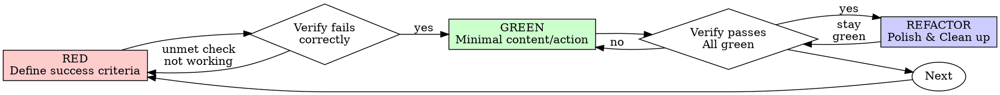

# Criteria-Driven Refinement (CDR)

## Overview

Define the success criteria first. Verify it is currently unmet/failing. Perform the minimal action/writing to meet the criteria. Refine and polish.

**Core principle:** If you didn't define success criteria and watch the verification check fail, you do not know if you're executing the right action or if your verification is actually testing the requirements.

**Violating the letter of the rules is violating the spirit of the rules.**

## When to Use

**Always:**
- Creating new documents or text content (reports, strategically structured emails, job application statements)
- Executing browser automations (filling fields, submitting applications)
- Moving/routing files and triaging documents
- Editing existing copy or content

Thinking "skip CDR just this once"? Stop. That's rationalization.

## The Iron Law

```
NO DELIVERABLE CONTENT OR STATE ACTIONS WITHOUT A FAILING CRITERIA CHECK FIRST
```

Write content before defining success criteria? Delete it. Start over.

**No exceptions:**
- Don't keep it as "reference"
- Don't "adapt" it while writing criteria
- Delete means delete.

Implement fresh from verified failure. Period.

## Red-Green-Refactor for General Tasks



### RED - Define Success Criteria

Write down one minimal, clear success criterion showing what should happen. Use one of our three multi-modal verification modes (Command, Browser/Visual, or Folder/File State).

<Good>
**Success Criterion:** Form filling task for personal details
- **Target URL:** `https://example.com/apply`
- **Verification:** Selector `#confirmation-dialog` is visible, and screenshot shows name field filled with "Alice".
</Good>

<Good>
**Success Criterion:** Document routing task for billing
- **Target path:** `/inbox/billing/invoice-1002.pdf`
- **Verification:** Run `ls /inbox/billing` and check that file invoice-1002.pdf exists, is >0 bytes, and metadata `processed_date` is logged.
</Good>

### Verify RED - Watch It Fail

**MANDATORY. Never skip.**

Check the folder, the browser selector, or run your validation script.
Confirm:
- The validation check fails (e.g. folder is empty, file doesn't exist, selector is missing, or screenshot shows form blank)
- The failure reason is exactly as expected (missing content/action)

**Already passes?** You're duplicating existing work. Fix the criteria or task.

### GREEN - Minimal Content / Action

Perform the absolute simplest writing or browser/file action to satisfy the success criteria.

Don't over-engineer. Don't add extra sections, write paragraphs of "nice to haves" that weren't in the criteria, or perform extra automation steps.

### Verify GREEN - Watch It Pass

**MANDATORY.**

Check the state or run the validation check again.
Confirm:
- The check passes
- Other criteria are still satisfied
- State is pristine

### REFACTOR - Refine, Tone, and Clean Up

After green only:
- Polish the tone, readability, flow, and structural layout of the text
- Extract common template components, DRY out configurations or selectors
- Ensure consistent styling

Keep verifications passing. Do not add new behaviors during refactoring.

---

## Why Order Matters

**"I'll write verifications after to make sure it is correct"**

Checks written after implementation pass immediately. Passing immediately proves nothing:
- You might check the wrong folder/page
- You never saw it catch a missing detail or error
- You test what you built, not what was actually required

**"TDD/CDR is dogmatic, being pragmatic means adapting"**

CDR IS pragmatic:
- Catches omissions and errors before final delivery
- Documents exact success definitions
- Ensures that every automation or content step is verifiable

## Common Rationalizations

| Excuse | Reality |
|--------|---------|
| "Too simple to check" | Simple tasks fail. Checks take 10 seconds. |
| "I'll check after" | Verifications passing immediately prove nothing. |
| "Already manually checked" | Ad-hoc ≠ systematic. Run systematic state checks. |
| "Deleting X hours is wasteful" | Sunk cost fallacy. Keeping unverified drafts is technical debt. |

## Verification Checklist

Before marking work complete:
- [ ] Every task step has defined, explicit success criteria
- [ ] Checked that each criterion was failing/unmet before starting
- [ ] Performed minimal action/writing to meet the criteria
- [ ] All verifications pass beautifully
- [ ] Checked across all relevant modes: Command, Browser/Visual, and Folder State

Can't check all boxes? You skipped CDR. Start over.
