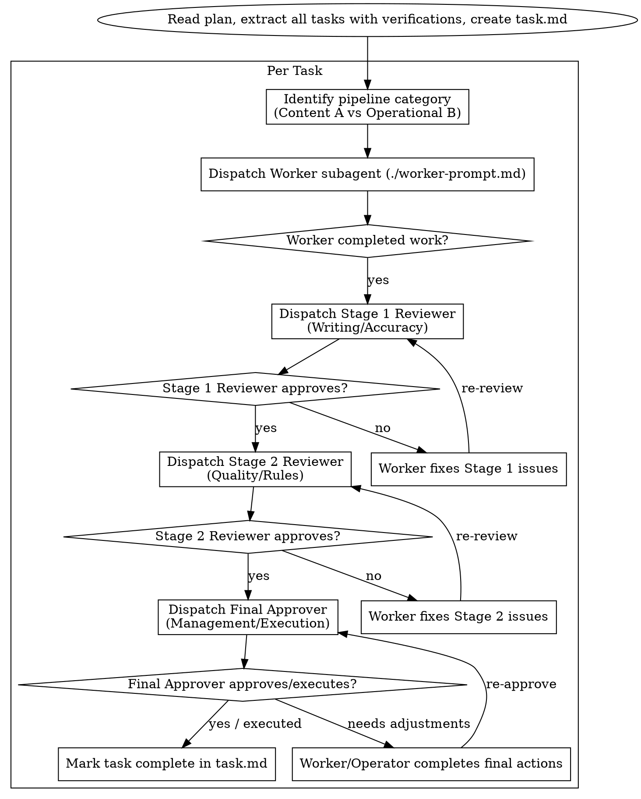

# Subagent-Driven Task Pipeline

Execute plans by dispatching specialized subagents per task, running them through a multi-stage review pipeline tailored to the task type.

**Why subagents:** You delegate tasks to specialized agents with isolated contexts. By precisely crafting their instructions and context, you ensure they stay focused and succeed at their task. They should never inherit your session's context or history — you construct exactly what they need. This also preserves your own context for coordination work.

**Continuous execution:** Do not pause to check in with your human partner between tasks. Execute all tasks from the plan without stopping. The only reasons to stop are: BLOCKED status you cannot resolve, ambiguity that genuinely prevents progress, or all tasks complete.

---

## The Review Pipelines

Depending on the task domain, select and dispatch the appropriate pipeline configuration:

### Configuration A: Content Creation & Drafting (e.g. Reports, Cover Letters, Strategy Specs)
1. **Worker/Writer:** Drafts the text or generates content based on task specs.
2. **Writing Editor (Tone & Flow):** Reviews style, tone, readability, structural organization, and flow.
3. **Quality Review Editor (Accuracy & Compliance):** Verifies that all facts, data points, and criteria checklists are strictly met.
4. **Management Reviewer (Strategy & Approval):** Signs off on the final value and readiness for delivery.

### Configuration B: Operational Execution (e.g. Online Form Completion, Document Routing)
1. **Worker/Operator:** Fills out forms in Chrome, extracts e-document text, or triages files.
2. **Accuracy Reviewer (Data Integrity):** Verifies that filled form fields or extracted metadata match source documents *exactly*.
3. **Logic/Rules Reviewer (Routing & Policy):** Verifies that classification and assignment follow specified business rules.
4. **Final Approver (Execution & Submission):** Performs the final save or submit action (e.g. clicking "Submit Application" or writing a routing log).

---

## Process Flow

## Prompt Templates
- `./worker-prompt.md` - Dispatch the Worker/Operator subagent.
- `./compliance-reviewer-prompt.md` - Dispatch Stage 1 (Writing/Accuracy) review.
- `./quality-reviewer-prompt.md` - Dispatch Stage 2 (Quality/Rules) review.
- `./final-approver-prompt.md` - Dispatch the Final Approver (Management/Execution).

## Integration
- **aerodeck:using-isolated-workspaces** - Prepares the isolated workspace (e.g. `Workspace: "branch"`).
- **aerodeck:writing-plans** - Generates the plan this pipeline executes.
- **aerodeck:completing-a-task-pipeline** - Finalizes the pipeline after all tasks are done.
