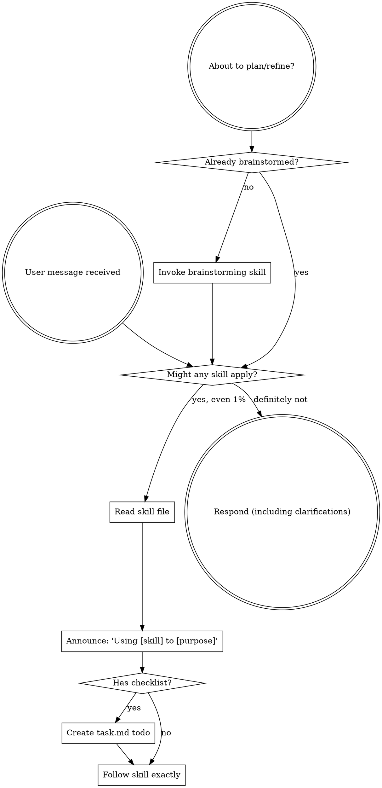

# Using AeroDeck

<SUBAGENT-STOP>
If you were dispatched as a subagent to execute a specific task, skip this skill.
</SUBAGENT-STOP>

<EXTREMELY-IMPORTANT>
If you think there is even a 1% chance a skill might apply to what you are doing, you ABSOLUTELY MUST invoke/read the skill.

IF A SKILL APPLIES TO YOUR TASK, YOU DO NOT HAVE A CHOICE. YOU MUST USE IT.

This is not negotiable. This is not optional. You cannot rationalize your way out of this.
</EXTREMELY-IMPORTANT>

## Instruction Priority

AeroDeck skills override default system prompt behavior, but **user instructions always take precedence**:

1. **User's explicit instructions** (CLAUDE.md, GEMINI.md, AGENTS.md, direct requests) — highest priority
2. **AeroDeck skills** — override default system behavior where they conflict
3. **Default system prompt** — lowest priority

If the user says "don't use the review pipeline" and a skill says "always use it," follow the user's instructions. The user is in control.

## How to Access Skills in AeroDeck

Skills are automatically discovered and loaded from the plugins folder. You can use the `view_file` tool to read the corresponding `SKILL.md` file for any skill at any time.

## Platform Adaptation

Skills use general task terminology. Non-coding operations are fully supported natively. Always refer to `references/antigravity-tools.md` to map standard tool behaviors (like reading files, browser devtools, web searching, and subagent dispatches) to your active harness.

## Using Skills

### The Rule

**Invoke/read relevant or requested skills BEFORE any response or action.** Even a 1% chance a skill might apply means that you should read the skill to check. If an invoked skill turns out to be wrong for the situation, you do not need to follow it.

### Red Flags

These thoughts mean STOP—you're rationalizing:

| Thought | Reality |
|---------|---------|
| "This is just a simple question" | Questions are tasks. Check for skills. |
| "I need more context first" | Skill check comes BEFORE clarifying questions. |
| "Let me explore the folder first" | Skills tell you HOW to explore. Check first. |
| "I can check files quickly" | Files lack conversation context. Check for skills. |
| "Let me gather information first" | Skills tell you HOW to gather information. |
| "This doesn't need a formal skill" | If a skill exists, use it. |
| "I remember this skill" | Skills evolve. Read the current version. |
| "This doesn't count as a task" | Action = task. Check for skills. |
| "The skill is overkill" | Simple things become complex. Use it. |
| "I'll just do this one thing first" | Check BEFORE doing anything. |
| "This feels productive" | Undisciplined action wastes time. Skills prevent this. |
| "I know what that means" | Knowing the concept ≠ using the skill. Invoke it. |

### Skill Priority

When multiple skills could apply, use this order:

1. **Process skills first** (brainstorming, problem-solving) - these determine HOW to approach the task
2. **Implementation skills second** (writing-plans, subagent-driven-task-pipeline) - these guide execution

"Let's build/write X" → brainstorming first, then implementation/planning.
"Fix this issue/blocker" → systematic-problem-solving first, then execution.

### Skill Types

**Rigid** (criteria-driven-refinement, systematic-problem-solving): Follow exactly. Don't adapt away discipline.

**Flexible** (patterns): Adapt principles to context.

The skill itself tells you which.

### User Instructions

Instructions say WHAT, not HOW. "Draft X" or "Route Y" does not mean skip workflows.
